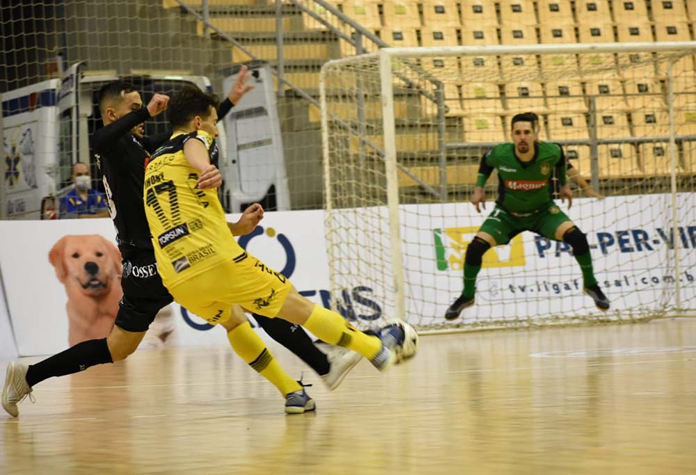
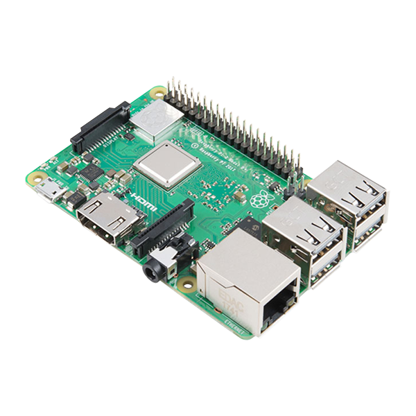
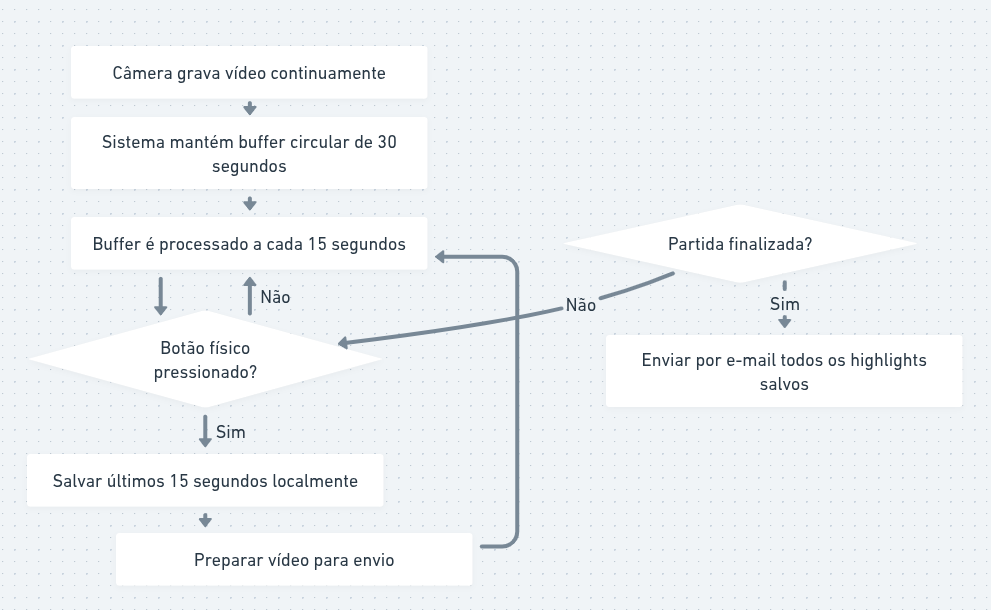

# Projeto: Sistema de Captura de Highlights em Partidas Esportivas

## Introdução

Este projeto consiste no desenvolvimento de um sistema de captura de vídeo baseado em Raspberry Pi, capaz de gravar continuamente uma partida esportiva e salvar automaticamente *highlights* de momentos importantes. A captura do momento é feita manualmente por meio de um botão físico, armazenando os últimos 30 segundos de vídeo. A solução foi inspirada em sistemas comerciais existentes, mas construída com foco em baixo custo e acessibilidade.



*Legenda: Exemplo ilustrativo de aplicação do sistema em quadra.*

---

## Motivação

A motivação central do projeto é viabilizar uma plataforma barata e acessível para registrar momentos importantes de atividades esportivas diversas, como futsal, vôlei, vôlei de praia, natação, polo aquático, entre outros.

O sistema foi pensado para funcionar de forma autônoma em uma Raspberry Pi, realizando a captura contínua de vídeo, armazenando recortes dos últimos segundos e enviando automaticamente os resultados por e-mail ao usuário ao final da partida.

---

## Problemática

Existem soluções no mercado capazes de registrar automaticamente *highlights*, porém geralmente são caras ou exigem infraestrutura adicional. A proposta deste projeto é reproduzir uma solução semelhante utilizando hardware acessível e software de código aberto.

---

## Justificativa da Solução

* Utilização de hardware amplamente acessível (Raspberry Pi 3B+ e 4B).
* Aproveitamento da câmera oficial Raspberry Pi P5v04a.
* Uso de bibliotecas open-source como OpenCV, Mediapipe, Picamera2 e APIs de envio de e-mail.
* Capacidade de adaptação do sistema para diferentes esportes.
* Possibilidade de evoluir futuramente para reconhecimento gestual ou inteligência artificial.

---

## Ferramentas, Bibliotecas e Dependências

### **Linguagem e frameworks**

* [Python 3](https://www.python.org/) (Versões testadas/suportadas: [3.9](https://docs.python.org/3.9/), [3.10](https://docs.python.org/3.10/), [3.11](https://docs.python.org/3.11/))
* [OpenCV](https://opencv.org/)
* [Mediapipe](https://mediapipe.readthedocs.io/en/latest/) (tentado, mas removido do escopo final)
* [Picamera2](https://picamera2.com/) (Biblioteca oficial da Raspberry Pi para manuseio de câmera)
* Biblioteca de envio de e-mail ([smtplib](https://docs.python.org/3/library/smtplib.html) / [email](https://docs.python.org/3/library/email.html))

### **Instalações necessárias (Raspberry Pi)**

#### Configuração da câmera

Adicionar ao arquivo `/boot/firmware/config.txt`:

```
start_x=1
gpu_mem=256
```

Se houver erro, remover:

```
#camera_auto_detect=1
```

e adicionar:

```
dtoverlay=ov5647  # Para câmera v1
```

#### Dependências (preferir apt ao pip para OpenCV)

```bash
pip install numpy
sudo apt update
sudo apt install libatlas-base-dev
sudo apt install libjasper-dev
sudo apt install libqtgui4
sudo apt install libqt4-test
sudo apt install libilmbase-dev
sudo apt install libopenexr-dev
sudo apt install libgstreamer1.0-dev
sudo apt install python3-opencv
sudo apt install v4l-utils
```

---

## 📦 Lista de Materiais Utilizados

* Raspberry Pi 3B+ e Raspberry Pi 4B
* Cartão microSD (mínimo 32GB recomendado)
* Câmera Raspberry Pi P5v04a
* Botão físico (push button)
* Fonte de alimentação 
* Cabo HDMI (opcional para debug)

### 🔍 Especificações da Raspberry Pi

| Modelo               | RAM                | CPU               | GPU          | Conectividade                  |
| -------------------- | ------------------ | ----------------- | ------------ | ------------------------------ |
| **Raspberry Pi 3B+** | 1 GB               | Quad‑core 1.4 GHz | VideoCore IV | HDMI, Wi‑Fi, Ethernet          |
| **Raspberry Pi 4B** |  8 GB              | Quad‑core 1.5 GHz | VideoCore VI | 2× micro-HDMI, Wi‑Fi, Ethernet |

<br>

<div style="display: flex; justify-content: space-around;">
    <div style="text-align: center;">
        
        <p><em>Placa Raspberry Pi 3B+ utilizada nos testes de baixo custo.</em></p>
    </div>
    <div style="text-align: center;">
        
        <p><em>Placa Raspberry Pi 4B (Versão 8GB).</em></p>
    </div>
</div>

---

## Esquema / Fluxo de Implementação

1. A câmera grava continuamente o vídeo.
2. O sistema mantém um buffer circular de 30 segundos, processado de 15 em 15 segundos.
3. Ao pressionar o botão físico:
   * Os últimos 15 segundos são salvos localmente.
   * O vídeo é preparado para envio.
4. Ao final da partida, o sistema envia por e-mail todos os *highlights* salvos.


*Legenda: Fluxograma operacional do sistema de captura e envio.*

---

## Tentativa de Reconhecimento Gestual com Mediapipe

Inicialmente, buscou-se implementar reconhecimento gestual, identificando um "X" formado pelos braços cruzados acima da cabeça. Entretanto, surgiram diversos desafios:

### Problemas encontrados:

* **Raspberry Pi 4 (64 bits)** não possui versão compatível oficial fácil do Mediapipe para a arquitetura aarch64 em alguns sistemas operacionais.
* A solução foi tentar utilizar o **Raspberry Pi OS 32 bits**, mas isso gerou conflitos complexos entre:
  * [Mediapipe (compilado para 32 bits)](https://github.com/google-ai-edge/mediapipe/releases) (Link para as releases do mediapipe).
  * [OpenCV (com dependências incompatíveis)](https://github.com/opencv/opencv/releases) (Link para as releases do Opencv). 
  * [NumPy (com dependências incompatíveis)](https://github.com/numpy/numpy/releases) (Link para as releases do Numpy).
* O processamento exigido por Mediapipe ultrapassava a capacidade de CPU, GPU e RAM, inviabilizando o uso em tempo real no hardware alvo.

### Decisão:

➡️ **O reconhecimento gestual foi removido do escopo final do projeto.**

---

## Funcionalidade Final Implementada

A implementação final inclui:

* Captura contínua da partida.
* Botão físico acionando o salvamento dos últimos 15 segundos.
* Possibilidade de registrar *highlights* ao longo da partida.
* Envio automático por e-mail para o usuário cadastrado.

Mesmo sem o módulo de IA gestual, o sistema mantém funcionalidade semelhante a soluções comerciais.

---

## Resultados e Testes

Os testes demonstraram:

* Baixa latência na captura e salvamento dos vídeos.
* Estabilidade maior no Raspberry Pi 3B+ para o escopo atual (devido à menor complexidade térmica e de OS em relação ao 4B 64bit para esta aplicação específica).
* Envio bem-sucedido dos vídeos por e-mail.
* Buffer circular funcionando corretamente para recortes de 15 segundos.

---

## Considerações Finais

* O projeto alcançou o objetivo de criar um sistema acessível e funcional para captura de *highlights* em partidas esportivas.
* A exploração inicial com Mediapipe gerou aprendizados importantes sobre limitações de hardware e compatibilidade de bibliotecas na arquitetura ARM.
* O sistema desenvolvido pode ser expandido futuramente com algoritmos mais leves de IA, integração com nuvem, detecção automática de eventos baseada em áudio, entre outros.

---

## Autores

- Lucas Sales Duarte
- João Marcelo Battaglini

  git config --global user.email "lucas.sales@usp.br"
  git config --global user.name "LucasDuarte026"
